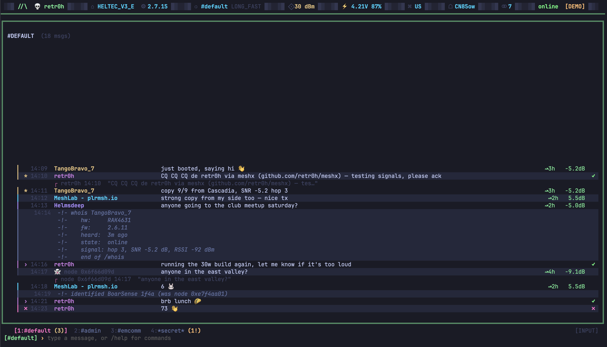

[](https://github.com/retr0h/meshx/releases/latest)
[](https://goreportcard.com/report/github.com/retr0h/meshx)
[](LICENSE)
[](https://github.com/retr0h/meshx/actions/workflows/go.yml)
[](https://github.com/retr0h/meshx/actions/workflows/release.yml)
[](https://github.com/goreleaser)
[](https://github.com/casey/just)
[](https://conventionalcommits.org)

[](https://pkg.go.dev/github.com/retr0h/meshx)

[](https://github.com/tekk/hovnokod-badge)

<p align="center">📡 Glitched-out terminal Meshtastic messenger.</p>

<p align="center">
  <a href="asset/ui.png"></a>
</p>

An irssi-style chat client for your LoRa radio with a vintage BBS
aesthetic — maxheadroom palette, `░▒▓█` glitch borders, BitchX-style
rotating splash, mutt-grade keyboard, and ham-radio slash-commands
baked in.

## ✨ Features

- 📡 **Connects to your Meshtastic radio** over USB serial or TCP (no radio needed for `--demo`)
- ⌨️ **irssi-style modal UI** — input always live, `Esc` drops to scrollback nav
- 💬 **mutt-grade message log** — dense one-row-per-message, zebra-striped, `j/k` walks
- 🎯 **Ham-radio slash-commands** — `/cq`, `/73`, `/qth`, `/rs`, `/qrz`, `/sk`, `/mesh`, + 9 more
- 👥 **BitchX-style bracketed users grid** — `[ @KC7XYZ  ]` tiles with IRC sigils
- 🎨 **Maxheadroom 80s-neon palette** — cyan / mesh-green / magenta / pink, matches grind + tlock
- 🎨 **BitchX-style rotating ASCII splash** — different graffiti logo every launch
- 🔎 **Live `/` search** across log / channels / users with `n` / `N` cycling
- 📑 **Tab completion** — commands, `#channels`, nicks; irssi nick-addressing quirk included
- 🖥️ **Stable tmux-pane channel tabs** + `Alt+1..4` quick-hop
- ❓ **Scrollable `?` help overlay** — every keybinding and command, vim-scrollable

## 📦 Install

```bash
curl -fsSL https://github.com/retr0h/meshx/raw/main/install.sh | sh
```

Installs to `~/.local/bin` (or `/usr/local/bin` as root) — SHA256 checksums verified. Override with `MESHX_INSTALL_DIR=/some/path` or pin a version with `MESHX_VERSION=1.1.1`.

### 🔨 Build from source

```bash
git clone https://github.com/retr0h/meshx.git
cd meshx
go build -o meshx .
install -m 755 meshx ~/.local/bin/meshx
```

## 🚀 Usage

```sh
meshx --demo     # no radio required — canned conversation to try the UI
meshx            # (future) auto-detect and connect to your Meshtastic device
```

## ⚙️ How It Works

meshX is a **Meshtastic client**. It connects to a radio you already
own (T-Beam, Heltec, RAK, Station G2, etc.) over one of three
transports and reads the mesh:

1. 🔌 **USB serial** (default) — plug the radio in; auto-detect port
2. 🌐 **TCP** — radios with WiFi expose port 4403, or connect to `meshtasticd`
3. 📱 **BLE** — future

All three speak [Meshtastic's protobuf protocol](https://github.com/meshtastic/protobufs).
meshX subscribes to `FromRadio` packets and emits `ToRadio` for sends,
surfacing everything in a scrollable terminal chat UI with vim/irssi
ergonomics.

Demo mode (`--demo`) ships canned messages + fake telemetry so you can
try the UI without a radio. Every report (`/rs`, `/ping`, `/tr`,
`/whois`) pulls from node state that maps 1:1 to real Meshtastic
protobuf fields, so the transport drops in without any UI changes.

## 💡 Inspiration

meshX sits at the intersection of three lineages:

- **[irssi](https://irssi.org/)** — the input-first modal UI, the `/command` dispatcher, and the stable bottom status line with channel tabs come straight from irssi. `Alt+n` channel hop too.
- **[BitchX](http://bitchx.sourceforge.net/)** — the rotating graffiti ASCII splash (different logo every launch), the bracketed `[ @nick ]` users grid, and the unapologetic neon palette are pure BitchX. (RIP caf.)
- **[mutt](http://www.mutt.org/)** — the dense one-row-per-message log, `j/k` scrollback nav, `r` reply on selection, and the modal input ↔ nav distinction come from mutt.
- **[vim](https://www.vim.org/)** — every window scrolls with `j/k/h/l/gg/G/Ctrl+D/Ctrl+U`, `Ctrl+W` for window nav, `/` + `n/N` for search.
- **[tmux](https://github.com/tmux/tmux)** — `Ctrl+N / Ctrl+P` channel cycle and the giant flash-digit pane picker.
- **[grind](https://github.com/retr0h/grind), [tlock](https://github.com/retr0h/tlock)** — sibling retr0h projects; meshX reuses their maxheadroom palette, `░▒▓█` block-border language, and block-art primitives.

## 🗺️ Roadmap

- [x] 🎨 Full irssi-style UI in demo mode
- [x] 🧑‍🎨 BitchX rotating splash
- [x] 📋 Ham-radio `/command` set (16 shortcuts)
- [x] 👥 Bracketed users grid
- [x] 🔎 Tab completion + `/` search + `n/N` cycling
- [ ] 🔌 USB-serial Meshtastic transport
- [ ] 🌐 TCP transport (`meshtasticd` / WiFi radio)
- [ ] 📡 Live telemetry surfacing (battery, SNR, RSSI per peer)
- [ ] 🔐 PSK import — `/channel add <meshtastic://url>`
- [ ] 🗺️ QR code share — `/channel share <name>`
- [x] 💾 SQLite scrollback persistence — message log survives restarts (`~/.meshx/meshx.db`); node cache still in-memory
- [ ] 📱 BLE transport (stretch)
- [ ] 🎨 Low-color / no-truecolor fallback palette — detect `$COLORTERM` / `$TERM` and swap the neon maxheadroom hex values for a 16-color ANSI ladder when the terminal doesn't support 24-bit color; same plan for the `░▒▓█` block chrome (ASCII fallback `===` / `---` for terminals without unicode block support)

## 📚 Docs

- [docs/commands.md](docs/commands.md) — every keybinding and slash-command, with the Meshtastic API call each command makes
- [docs/development.md](docs/development.md) — setup, testing, conventions
- [docs/contributing.md](docs/contributing.md) — PR workflow

## 📄 License

The [MIT][] License.

[MIT]: LICENSE
