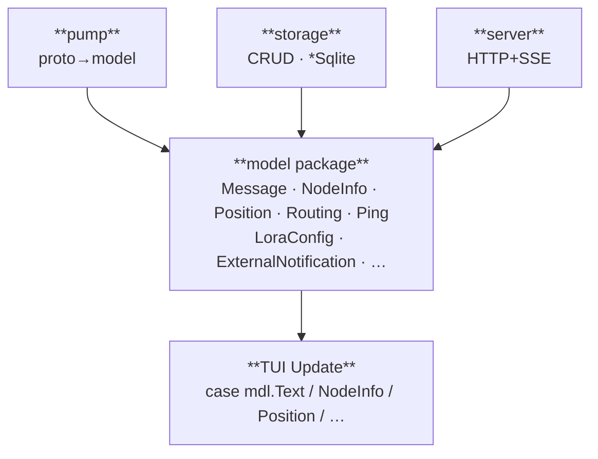
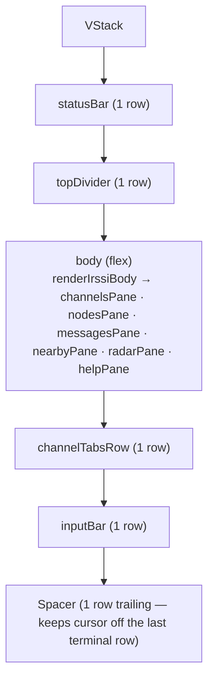

# Development guide

## Prerequisites

- macOS or Linux (terminal with ANSI + unicode block character support)
- [Go](https://go.dev/dl/) 1.21+
- [just](https://github.com/casey/just) — command runner
- [golangci-lint](https://golangci-lint.run/) — Go linter

## Getting started

```bash
git clone https://github.com/retr0h/meshx.git
cd meshx
just fetch    # fetch shared justfiles
just deps     # install tool dependencies
```

## Common commands

```bash
just deps          # install all dependencies
just test          # all tests (lint + format check + unit + coverage)
just ready         # format + lint before committing
just go::unit      # unit tests only
just go::vet       # golangci-lint
just go::fmt       # auto-format (gofumpt + golines)
just just::fmt     # format justfiles
```

## Running

```bash
go run .                                   # bare meshx — prints help (no auto-connect)
go run . usb scan                          # identify Meshtastic radios on USB
go run . usb connect                       # auto-detect single USB radio + open TUI
go run . usb connect /dev/cu.usbmodem2101  # explicit serial path
go run . usb probe --port /dev/cu.usb…     # deep diagnostic — dumps every FromRadio packet
go run . ble scan                          # nearby Bluetooth radios
go run . ble pair <uuid>                   # save for later connects
go run . ble list                          # show paired devices
go run . ble fav <uuid|name>               # mark bare-launch favorite
go run . ble connect <uuid|name>           # open TUI over Bluetooth
go run . ble probe <uuid>                  # 15s diagnostic FromRadio dump

# Headless HTTP+SSE daemon
go run . server start                      # bind 127.0.0.1:4404 (default)
go run . server start --bind :4404         # listen on all interfaces
MESHX_SERVER_BIND=:9000 go run . server start  # env-var override

# Debug logging — `--debug` (or MESHX_DEBUG=1) flips the global slog
# level so each subcommand's "running" line + the daemon's request log
# become visible. `--json` / `-j` swaps to JSON for log aggregators.
go run . --debug ble pair <uuid>
```

## Architecture

Package-level overview (file-level detail lives in each package's headers —
`ls internal/<pkg>/` + read the top-of-file comments):

| Package                     | Role                                                                                                                                                                              |
| --------------------------- | --------------------------------------------------------------------------------------------------------------------------------------------------------------------------------- |
| `cmd/`                      | Cobra command tree — `usb`, `ble`, `server`, `client`, `mcp` subcommands                                                                                                          |
| `internal/radio/`           | Per-radio session layer — canonical `*State`, `Apply*` handlers, `ops_*` (channels/config/radio/send), `Subscribe`/`Publish` fan-out, `RWMutex`-guarded for concurrent HTTP reads |
| `internal/transports/`      | Hardware management surface — `*Manager` for BLE/USB scan/pair/list/forget/fav                                                                                                    |
| `internal/server/`          | HTTP+SSE daemon (Huma) — multi-radio `Registry`, per-route handlers, auth, SSE events                                                                                             |
| `internal/mcp/`             | MCP server (stdio) — generated tools from OpenAPI spec (`tools_gen.go`), event subscription bridge, `Driver` consumer interface                                                   |
| `internal/sdk/gen/`         | Generated OpenAPI client (`client.gen.go`) + spec-dump generator (`dumpspec/`)                                                                                                    |
| `internal/sdk/`             | `*Remote` driver — TUI-as-HTTP-client mode (wraps `gen.Client` + SSE)                                                                                                             |
| `internal/tui/`             | Bubble Tea rendering — `Component` tree, layout primitives, pane Components, input/commands                                                                                       |
| `internal/meshx/model/`     | Canonical wire/persisted shapes — the lingua franca all layers share                                                                                                              |
| `internal/meshx/pump/`      | Transport ↔ tea bridge — reconnect policy, proto↔model translation                                                                                                              |
| `internal/meshx/storage/`   | SQLite persistence — messages, nodes, BLE devices, goose migrations                                                                                                               |
| `internal/meshx/transport/` | `Client` interface + serial/TCP/BLE implementations + frame codec                                                                                                                 |
| `internal/version/`         | Build identity (Version / Commit / Date / BuiltBy)                                                                                                                                |

````

### Public API

`internal/` packages are not re-exported. The cmd tree consumes them directly:

```go
tui.RunRadio("/dev/cu.usbmodem2101")         // live — serial or "ble:<uuid>"
transport.ScanBLE(timeout)                   // BLE discovery
transport.PairBLE(uuid)                      // OS-level bonding
transport.IdentifyAllSerial(timeout)         // USB scan + handshake probe
transport.AutoDetectMeshtastic(timeout)      // single-Meshtastic-port helper
storage.New(path) → *Sqlite                  // SQLite handle (BLE devices, messages, …)
server.New(server.Config{...}) → *Server     // HTTP+SSE daemon
````

`tui.RunRadio` calls
`tea.NewProgram(newModel(dest), tea.WithAltScreen()).Run()`.
`ble connect <name>` resolves the name through `storage.LookupBLEDevice` and
hands off to `tui.RunRadio("ble:<uuid>")` — `transport.Dial` routes the prefix
to `DialBLE`.

### `model` is the lingua franca

`internal/meshx/model/` holds the canonical wire/persisted shapes every boundary
in the codebase speaks. Three consumers all traffic in `mdl.X`:



Inbound, `pump/translate.go` projects `*pb.FromRadio` → `model.X` events.
Outbound, `pump/outbound.go::Send(model.Command)` is a type-switch dispatcher
that builds the matching `*pb.ToRadio` envelope. The pump package is the
**only** place in the codebase where `gomeshproto` types meet `model` types in
either direction. Everywhere else — the meshx TUI, the storage layer, future
daemon — sees only `mdl.X`. The proto<->model bridges for full-record configs
that need round-trip preservation (today: `ExternalNotification`) live in
`pump/config.go`; `commands.go` calls those bridges when crafting outbound
`AdminMessage` envelopes so it never directly assembles a config proto.

### Consumer interfaces (osapi-io pattern)

Both `pump.Pump` and `storage.Sqlite` are concrete structs in their own
packages. Where they're consumed (the meshx TUI), the consumer declares a narrow
interface listing only the methods it uses:

- `internal/meshx/pump.go` — `Pump` interface (`Enqueue`, `Stop`)
- `internal/meshx/store.go` — `Store` interface (the 17 methods the TUI calls)

Both interfaces sit next to each other so future consumers (e.g. a daemon
package) can declare their own — likely larger — interfaces without bloating the
TUI's view of the contract. The compile-time binding
`var p Pump = pump.New(...)` at the construction site catches drift the moment a
method gets renamed.

The same pattern applies in `cmd/`: `cmd/ble_deps.go` declares `bleScanner` /
`blePairer` / `bleStore` interfaces and `cmd/usb_deps.go` declares `usbScanner`.
Production wiring sits at the bottom of each file (`cliBLEScanner`,
`cliBLEPairer`, `cliOpenBLEStore`, `cliUSBScanner`) and tests can swap the
package-level vars to fake the host. The transport adapters
(`transportBLEScanner`, etc.) all delegate into `internal/meshx/transport`,
which means **`meshx ble scan`, `meshx usb scan`, etc. don't need a daemon to be
running** — they're direct OS interrogations.

## Deployment modes

Five modes share one binary, all converging on the same `*radio.Session` state
layer:

1. **Local TUI** — `meshx ble connect <name>` / `meshx usb connect` runs radio +
   TUI in one process. The TUI holds `*radio.Session` directly.
2. **Headless daemon** — `meshx server start` owns the radio behind HTTP+SSE; no
   TUI. Clients reach it over HTTP.
3. **Remote TUI** — `meshx client connect [<radio>]` runs the TUI against a
   remote daemon. `*sdk.Remote` satisfies `radioSession` over HTTP+SSE —
   outbound calls go through `gen.Client`, inbound events arrive via the SSE
   stream and get forwarded as `tea.Msg` into the same Update path the local TUI
   uses. The TUI doesn't branch on mode.
4. **CLI client** —
   `meshx client {status,scan,pair,list,forget,fav,unfav,send, tail}` — one-shot
   HTTP calls against the daemon for scripting / admin.
5. **MCP agent** — `meshx mcp start` opens a Model Context Protocol server over
   stdio. An agent (Claude Code, Cursor, …) spawns it per session; every daemon
   operation becomes an MCP tool the agent can call. When the agent disconnects,
   the MCP process exits; the daemon keeps running.

The daemon owns the BLE/USB adapter exclusively while it's running. CLI client
commands and the MCP server both route through the daemon's HTTP API — neither
touches hardware directly. This avoids two-process contention over the Bluetooth
stack.

Remote TUI mode has two independent reconnect loops: radio↔daemon (pump backoff
on the daemon side) and TUI↔daemon (SSE re-subscribe + snapshot re-fetch on
network blips). The daemon keeps the radio session alive across TUI restarts.

### Client lifecycle (modes 3–5)

```bash
# 1. Start the daemon (owns the radio long-term)
meshx server start --radio /dev/cu.usbmodem2101

# 2. From another terminal (or agent), use client commands:
meshx client status                   # is the daemon up? which radios?
meshx client scan ble                 # discover BLE radios via the daemon
meshx client pair <uuid>              # pair one
meshx client connect                  # open the TUI in remote mode
meshx client send 0xabcdef01 -t "hi"  # one-shot message
meshx client tail 0xabcdef01          # live SSE stream (jq-able)

# 3. Or wire an MCP agent (example: Claude Code config)
meshx mcp start --server http://127.0.0.1:4404
```

All flags / env vars for `meshx client` and `meshx mcp` are documented in
[`docs/configuration.md`](./configuration.md).

## Daemon, logging, config

`meshx server start` runs the HTTP+SSE daemon. Default bind is `127.0.0.1:4404`
(chosen to sit adjacent to meshtasticd's `4403` — "4403 talks to the radio, 4404
talks to clients of meshx"). The bind address resolves through viper: `--bind`
flag > `MESHX_SERVER_BIND` env > default. `MESHX_SERVER_RADIO` plus the
`--radio <dest>` flag pre-register a pending radio at startup.

Logging is a single package-level `slog.Logger` set up in
`cmd/root.go::initLogger` via `cobra.OnInitialize`. The default handler is
`lmittmann/tint` (colored when stderr is a TTY, plain otherwise); `--json` /
`-j` swaps in `slog.NewJSONHandler` for log aggregators; `--debug` / `-d` flips
the level. Subcommands tag their child logger with `subsystem=<verb>.<action>`
and emit a `Debug("running", …)` line at the top of each `RunE` so debugging
shows the parsed inputs without polluting default UX. The daemon emits `Info`
"config" + "listening" lines at boot and a structured request log line per HTTP
request.

`internal/server/middleware.go` wires three Huma middlewares (outermost-first):
panic recovery (logs stack + 500), request-id (honors inbound `X-Request-ID` or
generates 8-byte hex; echoes header, stashes on context, retrievable via
`server.RequestIDFromContext`), and a structured request log (method, path,
status, duration, request_id, remote, user-agent — Error level for 5xx, Warn for
4xx, Info otherwise).

## Server architecture

A request flows: Huma router → middleware stack (panic / request-id / log) →
`internal/server/handlers.go` → `resolveRadio({radio_id})` → `Registry.Get(id)`
→ `Driver` (the consumer interface in `internal/server/session.go`, satisfied by
`*radio.Session`). Handlers project model types (`mdl.ChannelItem`,
`mdl.NodeItem`, `mdl.MessageItem`) directly into responses — no DTO duplication,
the JSON shape on the wire IS the model shape. Multi-radio is the `Registry`
multiplex (`radio_id → Driver`, RWMutex-guarded); routes are radio-scoped under
`/radios/{radio_id}/...` and transport admin under `/transports/{ble,usb}/...`.
The SSE stream (`/radios/{id}/events`) sits on `Driver.Subscribe(ctx)` and
dispatches per-event-kind via `eventsTypeMap` so each variant gets the right
`event:` line on the wire.

## Code generation pipeline

The daemon's Huma router is the single source of truth for the API. Three
downstream consumers are generated from it, each invoked by `just generate` in
strict order — no running daemon required:

```
Huma router (internal/server/)
      │
      ▼  (1) dumpspec
api.yaml  (OpenAPI 3.0)
      │
      ├──▶ (2) oapi-codegen ──▶ client.gen.go  (typed HTTP client)
      │
      └──▶ (3) mcpgen ────────▶ tools_gen.go   (MCP tool registrations)
```

### Stage 1 — extract the OpenAPI spec

`internal/sdk/gen/dumpspec/main.go` imports `internal/server`, calls
`Server.OpenAPISpec()` to pull the 3.0 YAML straight from Huma in-process,
writes `api.yaml`. Registered as a `tool` in `go.mod` and invoked via
`go tool .../dumpspec` from the `//go:generate` directive in
`internal/sdk/gen/generate.go`.

### Stage 2 — generate the typed HTTP client

`oapi-codegen` (also a go.mod `tool`) runs against `api.yaml` + `cfg.yaml` to
produce `client.gen.go`. This is the typed Go HTTP client the TUI's remote mode
(`internal/sdk/remote.go`), the CLI (`cmd/client_*.go`), and the MCP server
(`internal/mcp/`) all consume.

### Stage 3 — generate MCP tool registrations

`internal/mcp/mcpgen/main.go` reads `api.yaml` with `kin-openapi`, and for each
operation (except SSE streaming endpoints) emits an args struct, a handler
method, and a tool registration call into `internal/mcp/tools_gen.go` using
`dave/jennifer`. When you add a new HTTP endpoint to the daemon and run
`just generate`, the matching MCP tool appears automatically — no hand-wiring.

### Running

```bash
just generate    # runs all three stages in order
```

The justfile sequences `go generate` per-package so stage 1 writes `api.yaml`
before stages 2 and 3 read it:

```
go generate ./internal/sdk/gen/...     # (1) dumpspec + (2) oapi-codegen
go generate ./internal/tui/emoji/...   # emoji widths (independent)
go generate ./internal/mcp/...         # (3) mcpgen
```

### Drift detection

`TestAPISpecMatchesVendoredCopy` (in `internal/server/server_test.go`) fails
`just test` if the on-disk `api.yaml` doesn't match what the in-process daemon
would emit — catches "someone changed a handler but forgot `just generate`."
Breaking changes are caught in CI by `oasdiff` between the PR branch's
`api.yaml` and main's — see `.github/workflows/go.yml`.

### Notes

- oapi-codegen still can't consume OpenAPI 3.1 (oapi-codegen #373) so the
  pipeline uses the 3.0 downgrade path.
- `client.gen.go` and `tools_gen.go` are both checked in so consumers can build
  without invoking codegen.
- **Schema-name caveat**: oapi-codegen auto-generates a `<OpId>Response` struct
  per operation. Avoid `*Response` schema names in handler types — that's why
  the send-message body is `SendMessageResult`, not `SendMessageResponse`.
- `internal/sdk/remote.go` is the hand-written companion that wraps
  `gen.Client` + an SSE consumer behind the `tui.radioSession` interface for
  remote-mode TUI. SSE isn't generated by oapi-codegen, so the event reader is
  hand-rolled against `/radios/{id}/events`.

## Dependencies

| Package                         | Purpose                                        |
| ------------------------------- | ---------------------------------------------- |
| `charmbracelet/bubbletea`       | Elm-style TUI framework                        |
| `charmbracelet/bubbles`         | textinput widget for input + search prompts    |
| `charmbracelet/lipgloss`        | colors, borders, layout primitives             |
| `spf13/cobra`                   | CLI command tree                               |
| `spf13/viper`                   | flag/env/default config resolution             |
| `lmittmann/tint`                | colored slog handler                           |
| `lmatte7/gomesh/...gomeshproto` | Meshtastic protobuf definitions                |
| `go.bug.st/serial`              | cross-platform USB-serial                      |
| `tinygo.org/x/bluetooth`        | cross-platform Bluetooth LE (macOS / Linux)    |
| `google.golang.org/protobuf`    | proto marshal / unmarshal                      |
| `mattn/go-sqlite3`              | SQLite driver (CGo) for scrollback persistence |
| `pressly/goose`                 | embedded SQL migrations                        |
| `danielgtaylor/huma/v2`         | HTTP+OpenAPI framework for the daemon          |
| `oapi-codegen/oapi-codegen/v2`  | Go client codegen from the OpenAPI spec (tool) |

## Modal UI — where the code lives

- **Mode constants** — `modeSplash`, `modeInput`, `modeNav`, `modeSearch`,
  `modeHelp` in `app.go`
- **Dispatcher** — `(m model) Update(tea.Msg)` routes by mode to `updateInput` /
  `updateNav` / `updateSearch` / `updateHelp` (splash is inlined)
- **Overlays** — `overlayNone` / `overlayChannels` / `overlayNodes`; set by
  `openOverlay()`, closed by `closeOverlayToInput()`
- **ESC is always "back to input"** — any sub-state maps back via
  `closeOverlayToInput()`

## Renderer conventions

- **Palette** lives in `palette.go`. Every color used by the UI is a named
  constant there; no inline hex elsewhere.
- **Zebra rows** — `rowBgEven` / `rowBgOdd`; message log picks via
  `zebraBg(index)`.
- **Selection highlight** —
  `wrapSelection(content, selected, isSearchHit, width, rowBg...)` wraps any row
  with a gutter + tinted bg. Used by the message list, channels overlay, and
  users grid. Tail-pads use an explicit bg-styled span (not a lipgloss outer
  wrap) because each inner SGR ends in `\e[0m` which would reset any outer bg
  before the trailing spaces — without the explicit span the zebra row drops off
  after the body's last character.
- **Truncation** — `padCells` (in `box.go`) is the canonical pad/truncate
  funnel; it builds on `ansi.Truncate` so styled prefixes survive the cut and
  ANSI SGR sequences are never split mid-byte.
- **Pane accents** — `paneAccentColor(paneIdx)` returns the per-pane signature
  color (channels = cyan, messages = mesh-green, nodes = magenta). Used by
  focused-pane borders and the giant pane-number overlay.

### Layout primitives — Component tree

`components_box.go` and `components_stack.go` define the layout vocabulary the
`View()` tree is built from. Every region of the UI is a `Component` whose
`Render(box Box) string` returns precisely `box.Height` lines, each precisely
`box.Width` cells per `ansiCells`. There is no upward negotiation — parents own
the math, children fill what they're given.

- `Box{Width, Height}` — the cell budget a Component must fill exactly.
- `Component` — interface; one method, `Render(box Box) string`.
- `Row` / `Cell` — single-row horizontal layout. Cells declare width (or `-1`
  for flex), an optional `PadStyle` to tint cell-internal padding, and an
  alignment; `Row.Render` truncates anything that would overflow the box and
  pads anything short. `Row.FillStyle` tints the trailing flex fill so a zebra
  row stays a solid rectangle past the last cell.
- `Text`, `Spacer` — leaf renderers (single string filling a box, blank fill).
- `RawBlock` — wraps a pre-rendered multi-line string and fits it into a Box;
  the bridge between legacy string emitters and the layout tree, used by
  `renderBorderedPane` and `frameView`.
- `Viewport` — scrollable single-pane window over a slice of pre-styled lines
  with optional footer chrome. Owns scroll-clamp + visible-row math; consumed by
  `helpPane`.
- `Centered` — pane-aware horizontal + vertical centering (each line padded
  against the parent Box, not its own width).
- `VStack` / `HStack` — vertical / horizontal stack of `SizedChild` with flex
  (-1) sharing.
- `Bordered` — wraps an inner Component in a `╔═══╗` / `┌───┐` frame with
  optional padding, subtracting border + padding from the inner box. Replaces
  the legacy lipgloss `paneStyle` so message panes / overlays measure with
  `ansiCells` (keycap-aware) instead of runewidth (which under-counts VS16 emoji
  and pushes the right `║` out of column).
- `Styled` — applies a styler to an already-composed Component without changing
  cell count.

`ansiCells` is the single source of truth for measurement. It starts from
`ansi.StringWidth` and promotes any grapheme cluster containing VS16 (U+FE0F) or
COMBINING ENCLOSING KEYCAP (U+20E3) to 2 cells per Unicode TR51
emoji-presentation rules — without this, "7️⃣"-bodied rows render 1 cell wider
than the layout pipeline thinks they are and the right `║` frame walks out of
column.

Concrete Components live in:

- `components_chrome.go` — `statusBar`, `topDivider`, `channelTabsRow`,
  `inputBar` plus per-segment cell builders.
- `components_panes.go` — pane Components (`channelsPane`, `nodesPane`,
  `messagesPane`, `helpPane`) plus `frameView`, `renderIrssiBody`,
  `renderBorderedPane`, `paneAccentColor`, `paneInnerWidth`,
  `messagesPaneRender`, `tailStartList`. Each pane Component owns its
  implementation directly — no model-method shims.
- `components_panes_geo.go` — `nearbyPane`, `radarPane` and the `peerPlot` data
  prep both consume.
- `components_message.go` — `messageRow` Component owns the notice/system/chat
  dispatch via `noticeRowRender` / `chatRowRender` and forces every line through
  `padCells`.
- `components_chat.go` / `components_notice.go` / `components_overlays.go` /
  `components_radar.go` — leaf cell builders the rows compose. Selection chrome
  (`wrapSelection`, `gutterWidth`, `dimRow`) lives in `components_overlays.go`.

The frame `View()` builds:



Set `MESHX_LAYOUT_ASSERT=1` to enable dev-mode invariant panics: every
`Component.Render` is checked to return exactly the requested box, so a
regression in cell-counting math surfaces as an immediate panic at the offending
call site instead of as visible drift two rerenders later. The env lookup is
hoisted to a package-level once-read in `components_box.go`, so the check is
free in production. Run the test suite with this flag set in CI.

## Tab completion

`complete.go`:

- `slashCommands` — canonical command list for tab cycling
- `computeCompletions(text, cursor)` — returns `(matches, start, end)` based on
  current word context:
  - Word starts with `/` → command universe
  - Word starts with `#` or `*` → channel names
  - Otherwise → node callsigns
- `applyCompletion(text, start, end, match)` — inserts the match. At
  start-of-line + nick match, appends `: ` (irssi nick-address idiom); otherwise
  a plain space.
- Cycling state lives in `tabState` on the model; any non-Tab keypress clears
  it.

## Ham command dispatch

Every ham `/command` runs through `executeCommand(raw string) tea.Cmd` in
`commands.go`. Target-taking commands default to the highlighted sender in nav
mode via `selectedSender()`.

Reports use real node telemetry:

```go
n := m.lookupNode(target)          // pointer to node or nil
report := signalReport(n)          // "hop 2, SNR -8.5 dB, RSSI -92 dBm"
```

Every field on `NodeItem` (`LastSNR`, `LastRSSI`, `LastHops`, `HwModel`,
`Firmware`) is populated from Meshtastic protobuf — `MeshPacket.rx_snr`,
`rx_rssi`, `hop_start - hop_limit`, `MyNodeInfo.HardwareModel`,
`firmware_version`.

## Radio transport

`internal/meshx/transport` wraps the Meshtastic USB-serial / TCP wire protocol.
`Dial(dest)` returns a `Client` whose `Send(*ToRadio)` enqueues outbound
envelopes and `Stream(ctx)` returns a `<-chan *FromRadio`. The framing is
identical across serial and TCP: `0x94 0xc3 <hi> <lo> <protobuf>` — see
`framing.go`.

`AutoDetectMeshtastic(timeout)` walks `/dev/cu.*` ports, handshakes each, and
returns the first that talks Meshtastic. Used by `cmd.usbConnect` with no
explicit device path, and by `meshx.AutoConnectTarget` for the bare-`meshx`
resolution chain.

`pump.go` runs as a goroutine kicked off from the model's `Init()` via
`openPumpMsg` — deferring the spawn until after `tea.Program.Run()` avoids a
`program.Send()` deadlock. Each `FromRadio` envelope is mapped to exactly one
`radio<Name>Msg` type and sent to the tea loop.

## Persistence — SQLite scrollback

Live-radio mode opens `~/.meshx/meshx.db` (WAL journal, `_busy_timeout=5000`)
via the `internal/meshx/storage` package and replays the last 500 messages on
boot. The TUI consumes a narrow `Store` interface (defined in `store.go`); the
concrete `*storage.Sqlite` implements it. The schema is one flat `messages`
table mirroring `mdl.Message` (the wire/persistence shape that `MessageItem`
embeds) plus a `channel` column. System / flash rows are skipped on save. Write
errors are logged-then-swallowed; losing history beats crashing the UI.

## Threading

Directed ham verbs (`/73 <call>`, `/qsl <call>`, `/sk <call>`, `/rs <call>`,
`/cqr <call>`, `/k <call>`, `/qrm <call>`, `/qsb <call>`) set `Data.reply_id` on
the outgoing packet pointing at the target's most recent message's
`MeshPacket.id`. The lookup runs via `replyTargetFor(call)`;
`newTextToRadio(text, channel, replyID)` threads it onto the wire.

Receive side: the pump's `mdl.Text` event carries both `PacketID` (the incoming
packet's id) and `ReplyID`, and `applyTextMessage` records them on the embedded
`mdl.Message` of `messageItem`. The renderer checks `msg.ReplyID != 0` and, when
the parent is findable in `m.messages`, prepends a dim quoted-parent line above
the reply row:

```
  ┌ KC7XYZ 🦀 13:52  "Test, plz confirm"
› me  13:53  /73 KC7XYZ — 73 KC7XYZ                                  ✓
```

`findMessageByPacketID` resolves parent lookups; `truncateRunes` caps the quoted
body so long parents don't blow the width budget.

## Testing

Every PR that adds or changes behavior ships with the tests that verify it. **No
"Test plan" sections in PR descriptions that ask the human to verify by hand.**
Manual checklists rot; automated tests don't. If a behavior genuinely cannot be
tested (real-radio integration, browser-only EventSource semantics, hardware
reset), call it out explicitly — don't bury it.

### The shape rule (non-negotiable)

**One test function per public surface. Every test is table-driven.** A test
that exercises only one scenario today is still written as a one-row table — the
second scenario is a new row, not a new function. Don't write
`TestFooHappyPath`, `TestFooMissingField`, `TestFooNotFound` as three separate
functions; those are three rows of `TestFoo`. Ad-hoc sibling test functions are
forbidden.

A "public surface" is:

- An HTTP route (one `TestEndpoint<OperationID>` per route registered in
  `routes.go`).
- An exported type's public method (one `Test<Type>_<Method>` per method — see
  naming below).
- A package-level function (one `Test<Function>` per function).

#### Naming

| Subject in code                        | Test name                 |
| -------------------------------------- | ------------------------- |
| `LoadAuthToken` (function)             | `TestLoadAuthToken`       |
| `Session.ApplyText` (method on a type) | `TestSession_ApplyText`   |
| HTTP route operation `SendMessage`     | `TestEndpointSendMessage` |

The underscore is reserved for the `Type.Method` separator — Go-stdlib idiom
(`TestFile_Stat`, `TestBuffer_WriteByte`), and `go test -run Type/Method`
formats it cleanly. Never use the underscore as a `_HappyPath` / `_Failure`
discriminator — those are table rows, not function names.

#### Tables, always

Scenarios go in a single `[]struct{name, ...}` table. When their mechanics are
uniform (same setup, same act/assert shape, different inputs and expectations),
the loop body is one block. When scenarios genuinely diverge in mechanics (one
tests cancellation, another tests delivery), the table holds a
`run func(t *testing.T)` field per row OR use
`t.Run("scenario-name", func(t *testing.T) { ... })` sub-tests under the same
parent — _still one parent function_, never sibling top-levels.

```go
func TestEndpointSendMessage(t *testing.T) {
    t.Parallel()

    cases := []struct {
        name       string
        body       any
        wantStatus int
        wantBody   func(t *testing.T, body []byte)
    }{
        {
            name:       "happy-path-broadcast",
            body:       SendMessageRequest{Channel: 0, Text: "hi"},
            wantStatus: http.StatusOK,
            wantBody: func(t *testing.T, body []byte) {
                var got SendMessageResult
                require.NoError(t, json.Unmarshal(body, &got))
                require.NotZero(t, got.PacketID)
                require.True(t, got.OK)
            },
        },
        {
            name:       "happy-path-dm-with-to_num",
            // …
        },
        {
            name:       "rejects-empty-text-422",
            body:       SendMessageRequest{Channel: 0, Text: ""},
            wantStatus: http.StatusUnprocessableEntity,
        },
        {
            name:       "rejects-unknown-radio-404",
            // …
        },
    }
    for _, tc := range cases {
        t.Run(tc.name, func(t *testing.T) { /* shared act/assert */ })
    }
}
```

### File naming (non-negotiable)

**One test file per production file: `foo.go` is tested by `foo_test.go` —
nothing else.** When you write a test for code in `transport_ble.go`, the test
goes in `transport_ble_test.go`, not `handlers_transport_ble_test.go` or
`ble_handlers_test.go` or anything else. The pairing must be obvious from a
directory listing.

Two narrow exceptions, and only these two:

1. **Shared test fixtures / fakes** can live in a `*_test.go` file with no
   production counterpart — e.g., `helpers_test.go`, `fakes_test.go`. Use only
   when fixtures are genuinely shared across multiple production files' tests;
   otherwise inline them.
2. **`main_test.go`** for `TestMain` / package-wide setup.

Test files for code in `handlers.go` that grew enough to split (e.g., separate
tests for send-message vs list-messages logic) is a signal that `handlers.go`
itself should be split into `handlers_send_message.go` + `handlers_messages.go`
first — never invent a `_test.go` file that doesn't pair with production.

### Tooling

- **`testing` + `testify/require`** for unit tests. Standard library first;
  reach for `testify` only when an assertion would otherwise need a long custom
  message.
- **`net/http/httptest`** for every HTTP and SSE endpoint —
  `httptest.NewServer(s.http.Handler)` against the same `*Server` production
  uses. No fake handlers, no parallel mock router.
- **In-process `*radio.Session`** (constructed via `radio.New(nil, nil, nil)`)
  for testing the apply / publish / subscribe paths without a real radio. Inject
  events via `Session.Publish`; assert on `Subscribe` / `SubscribeWithReplay`
  output. For radio-dispatch verification (commands reaching the pump), satisfy
  `radio.Pump` with a fake that captures dispatched commands — see `fakePump` in
  `internal/server/handlers_radio_ops_test.go` for the canonical shape.
- **Race detector** — `go test -race ./...` for anything with goroutines
  (Subscribe, Pump, the SSE handler). Cheapest way to catch a slipped lock.

### HTTP-specific rules

- **100% endpoint coverage.** Every route registered in
  `internal/server/routes.go` has a dedicated `TestEndpoint*` test function with
  happy-path + every distinct failure mode as table rows. If a route isn't
  tested, the PR isn't done.
- **Verify the wire shape on happy paths.** Every happy-path row decodes the
  response body into the exported response type (`mdl.MessageItem`,
  `SendMessageResult`, etc.) and asserts on key fields. Catches "we accidentally
  renamed a JSON field" before the SDK regen does.
- **Cover failure modes explicitly:** missing-required-field (422),
  unknown-radio (404), bad path-param (400/422), buffer-full / pump-down (503),
  validation rejects (422). One row per distinct failure.
- **Test naming.** `TestEndpointListMessages`, `TestEndpointSendMessage`,
  `TestEndpointMintChannel` — operation-id-shaped, predictable from the route
  registration.

### Other rules

- **Test public-facing surfaces** — the HTTP route, the exported type, the wire
  shape. Internal-only helpers can be tested incidentally through their public
  callers; don't write a parallel test for every unexported function.
- **Bound waits.** Anything blocking takes
  `select { case … : case <-time.After(time.Second): t.Fatal("timed out") }`. A
  test that hangs the whole suite on regression is a bad test.
- **No t.Skip on production code paths.** A test you skip is a regression you
  ship.

### Test plan in PR descriptions

The PR template's "Test plan" section is for **what the test suite covers**, not
what the human needs to do. Reference the test names, not "checked locally":

```
## Test plan

- [x] `TestEndpointSendMessage` — happy paths (broadcast, DM via to_num, reply via reply_id) + failure rows (empty text, unknown radio, idempotency dedupe)
- [x] `TestEndpointListMessages` — empty state, with limit, with ?dm=mine filter, unknown radio
- [x] `TestSessionPublish` — monotonic IDs, fan-out to N subs, ring overflow keeps newest, cursor replay
```

### Running

```bash
just test                                    # full suite (lint + format + unit + coverage)
go test -race ./...                          # all tests with race detector
go test -run TestEndpointSendMessage ./internal/server/  # one test, verbose
```

## Color palette (Max Headroom)

All constants in `palette.go`:

```
#ffb86c  orange    - timer / battery warnings
#00d4ff  cyan      - inactive channel tabs, unfocused headers
#c678dd  magenta   - "me" messages, nodes pane accent
#50fa7b  green     - online node state, ACK ✓
#e5c07b  yellow    - unread counts, !bang command prefix
#ff6ec7  pink      - ACTIVE channel tab, error flashes
#6272a4  lavender  - muted states, "other" tab names
#c0caf5  fg        - default text
#3b4261  drained   - labels, separators, dim italic hints
#67ea94  meshgreen - focused pane border, input prompt, brand
```

## Sister projects

| Project                                                        | Description                              |
| -------------------------------------------------------------- | ---------------------------------------- |
| [tlock](https://github.com/retr0h/tlock)                       | Terminal lock screen with Touch ID       |
| [grind](https://github.com/retr0h/grind)                       | 8-bit retro terminal timer               |
| [osapi](https://github.com/osapi-io/osapi)                     | Linux system management REST API and CLI |
| [osapi-justfiles](https://github.com/osapi-io/osapi-justfiles) | Shared justfile recipes                  |
